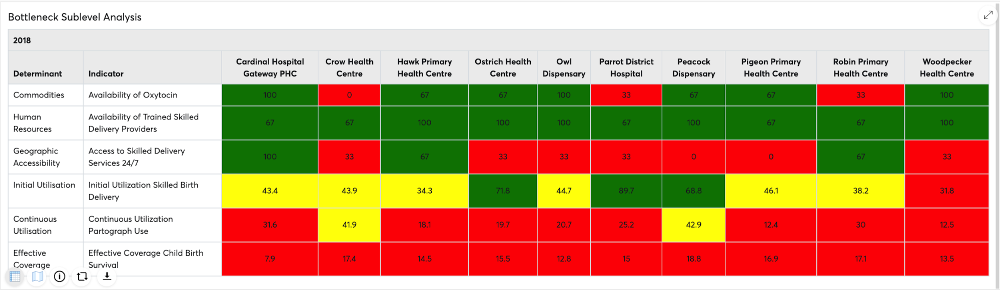

# BNA Analysis and Interpretation

Bottleneck analysis a systematic way to look at the main determinants of
effective coverage for selected interventions to identify problem areas
to purposely act on them. The Six coverage determinants, from supply to
demand side, provide a mechanism to analyze where health system
bottlenecks exist. A bottleneck is a loss of system
efficiency. (Adapted from [Tanahashi T. Bulletin of the WorldHealth Organization, 1978, 56\(2\)_295-303.pdf](http://whqlibdoc.who.int/bulletin/1978/Vol56-No2/bulletin_1978_56&#40;2&#41;_295-303.pdf)).

Each intervention in the bottleneck analysis application comes with
three intervention items, the bottleneck analysis chart and sublevel
analysis table, and root cause analysis widget which are there to assist
the district user in analysing the bottlenecks and enter the route
causes and solutions for each identified bottleneck.

## Bottleneck chart operations

The bottleneck analysis chart is a bar graph of the bottleneck
indicators sub-divided in groups of their determinants. The bottleneck
analysis chart can be configured through the global filters whereas the
national level administrator can make data selections and sort the
arrangement of the determinants, determinant group color, organization
unit and period filters for other national users who are not
administrators, regional, and district users to make changes on
organization unit and period filters.

## Analyzing bottleneck Charts

1.  Start from left to right: supply first, then demand, then quality
2.  Identify the lowest bar in the supply side (weakest determinant in
    the existing system)
3.  Identify the biggest drop in the demand side and quality

A bottleneck is a significant gap or drop in coverage determinant
between the expected and the observed. Services must be available first
before they are used. Therefore, bottlenecks are analyzed starting with
supply, followed by demand and finally by quality. The cascade rule
means that quality can not be higher than demand, and demand higher than
supply.

To highlight bottlenecks in the charts, simply click on the bar that
represents the identified bottleneck. The bar should change to color
RED.  This color is not saved as part of the values that represent the
different performances.

> **NOTE**
>
> To deselect the highlighted bars, click once
and the colors will be deselected to the default.

When the graph seems different from what we expect, care should be given
to assess common factors e.g. using different denominators for supply,
demand and quality.

## Sublevel Analysis

The sublevel analysis table makes use of the global filters that the
bottleneck analysis chart makes use of with an additional operation of
legend configurations for each indicator, that has been selected. It
presents sublevel analysis of performance each of the indicators in
determinant groups for selected intervention.

In sublevel analysis table, user can transpose the layout  of the table
to exchange presentation of indicators and sublevels. To transpose the
table, you have to click an icon just before the download icon below the
sublevel analysis table.

## Additional Indicator dictionary

The BNA app is equipped with an indicator dictionary to provide
additional information on the indicators used in the definition and
creation of the BNA chart. To access the indicator dictionary, click on
the (i) icon in the sub-level analysis table.

The indicator dictionary will display the list of indicators used in
creating the BNA chart, including numerators and denominators,
calculation details, and corresponding data elements. You can also click
on the “Export” button to export the indicator dictionary to excel. To
switch back to the table view, click on the Table icon.

## Root Cause analysis

After the district user has looked at the Bottleneck Analysis Chart and
the Sublevel Analysis Chart and has identified the major bottlenecks,
they are expected to proceed to the Root Cause Analysis Widget. In the
root cause analysis widget they can document the Root causes and
Solutions of determinants and indicators for the active intervention
based on the period and organization unit filters applied.

At first glance the widget will come up empty and the user can create a
new empty row by simply clicking the “Add New” button that is available
right under the widget. The new empty row comes pre-populated with the
row counter, Intervention Name, Period Name and Organization Unit Name.

The user can select determinants and indicators from the dropdown lists
and use the free texts to document the root cause and solutions. Once
done there is a tick icon on the solution column, the user will click
this icon to save the data.

The quality of the causality analysis is a critical determinant of the
quality of the resulting plans and the impact on health system
performance. It is important to have around the table people with the
right knowledge and expertise.

Once a bottleneck is identified, the root causes need to be thoroughly
assessed

It is important to know what to look for when facilitating a root cause
analysis.

1.  Common causes of bottlenecks in the health system (specific for each
    determinant)
2.  Main environmental factors (Social Norms, Legislation/ Policy,
    Budget/ expenditure, Management/ Coordination)
3.  Possible crisis/hazards (if relevant)

Once identified, proposed solutions/ actions need to be documented for
follow-up and implementation.

To edit data the user can simply double click a row to make active for
editing or right click a row to get a context menu. Currently the
context menu has two operations Edit and Delete, whereas, selecting
“edit” makes a column active for changes and selecting “delete”
removes the data of the particular row from the system.

