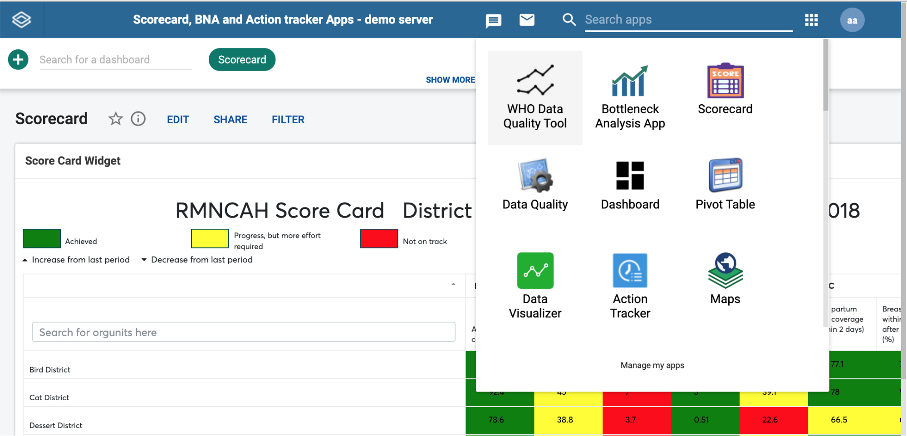
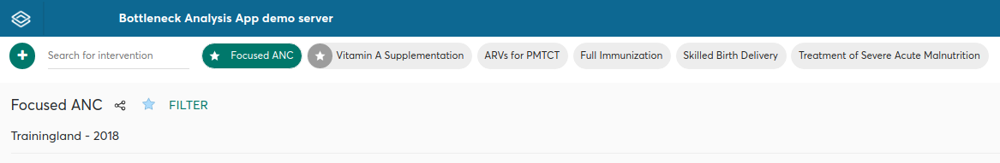
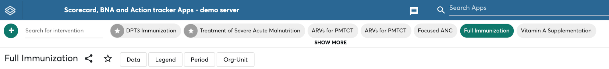

# BNA App architecture

The BNA Application is built on architecture that eases the user
interactions by having a design concept that promotes the user to follow
their intuition complemented with high performance that considers the
lowest internet connection scenarios with descriptive notification
messages if the user misses a step along the way.

## BNA App Design concepts

### Do more with less steps

Most of the operations in the application can be achieved in three steps
or less. The BNA App gives a district user or any user at any level with
no administrative privilege the ability to perform operations without a
need to switch between modules or drop ongoing activities. Users can
bookmark interventions, filter interventions by organization unit or
period and more with everything being just a click away.

### Trust your intuition

The BNA App has been built from the ground app, to make functionalities
more accessible, more intuitive and most importantly more capable. The
App follows a minimalistic design that minimizes any chances of the user
getting lost in the middle of performing their usual operations.

## Layout of the BNA App

The BNA App is flexible to adapt to any number of user journeys
depending on country’s implementations. The primary two users are the
Administrator who can manage the interventions,  the district users who
analyze the bottlenecks.

The administrator can manage interventions with operations such as
creating interventions, applying data filters for interventions, making
legend definitions and many more administrative operations.

The district users who analyze the bottlenecks can switch through their
interventions, bookmark their favorite interventions and perform root
cause analysis through the root cause analysis widget.

Other bottleneck App users can be national, and regional/counties users
users who can only analyses bottleneck, sub-nation analysis, route
causes for each bottleneck and their solutions.

## Global DHIS2 Menu

When using the Bottleneck analysis App the Global DHIS2 Menu is
accessible on its usual position. The user can use the global menu to
access other apps and to log out of the system. Most of the app
notifications will pop on the top position where the DHIS2 global menu
exists.

## Interventions list

The interventions list is found just under the DHIS2 global menu. Users
can only see the interventions if they created them or shared to them.
Accessing the shared interventions is limited to the access level they
are shared.

## Interventions Global filters

Right under the interventions list there are controls for the active
interventions. The filter control when clicked expands to offer the user
an ability to make data selections, period selections, organization unit
selections, and legend configurations. However, all users except
administrators have access to Period Organization unit filters only.
More details on these operations can be found on chapter 4 section 4.

## Intervention items

All interventions in the BNA App contains three items, namely:

1.  The Bottleneck Analysis Chart
2.  The Sublevel Analysis Table
3.  The Root Cause Analysis Widget

These intervention items will be empty when an intervention is created.
The administrator is expected to configure the intervention items by
making selections on the global filters. More details on how to
configure interventions can be found on Chapter 4 Section 5. The
district user is expected to enter data into the root cause analysis
widget as explained in the next chapters.
