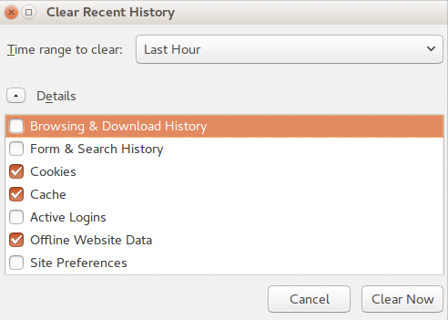

# BNA App Maintenance

If BNA application is taking too long to load, and you’re not on a slow
network, make sure you have cleared your browser cache.

BNA Application makes good use of cached files for better offline
experience, as a result, when installing higher version, BNA Application
may use older version of cached files and thus break down while loading.

## Clearing application cache

Approaches to clear application cache and browser interface, vary from
browser to browser; for example for Mozilla Firefox the keyboard
shortcut is “CTRL+SHIFT+DELETE” while for Google chrome the keyboard
shortcut is “CTRL+SHIFT+J”.

Accessing interface for clearing browser cache can be done via the
following approaches:                • Google chrome​: Go to the menu
icon on the top right corner, and click it to open, go to more tools
menu, and choose “Clear browsing data”. Once interface is open, Make
sure, “Clear the following items from” is set to “The beginning of
time”.                                 

• Mozilla Firefox​: Go to the menu icon on the top right corner, and
click it to open, go to -\>Library, and go to History, and choose “Clear
recent history”. Once interface is open, Make sure “Time range to clear”
is set to “Everything”, and “Details” option is expanded to show all
details options. Once on the clear browsing data or recent history, tick
“Cache”, “Cookies”, “Hosted app data” or “Offline Website data”. To
clear all cached files, cookies and locally stored data by bottleneck
.        

 

> **NOTE**
>
> These will also clear all cache information
and cookies from other websites you visited in your browser.

## BNA App Error Messages

The BNA Application has error messages for the expected errors that
could occur. For example attempting to access metadata that no longer
exists in the system.

