# Navigating the BNA App

Bottleneck analysis application can be found in the Apps menu. if the
application has not yet been installed in your DHIS2 instance or
installation has issues, refer to the installation instructions (Chapter
2) of this documentation for further guidance, or contact the
DHIS2 administrator for your instance.

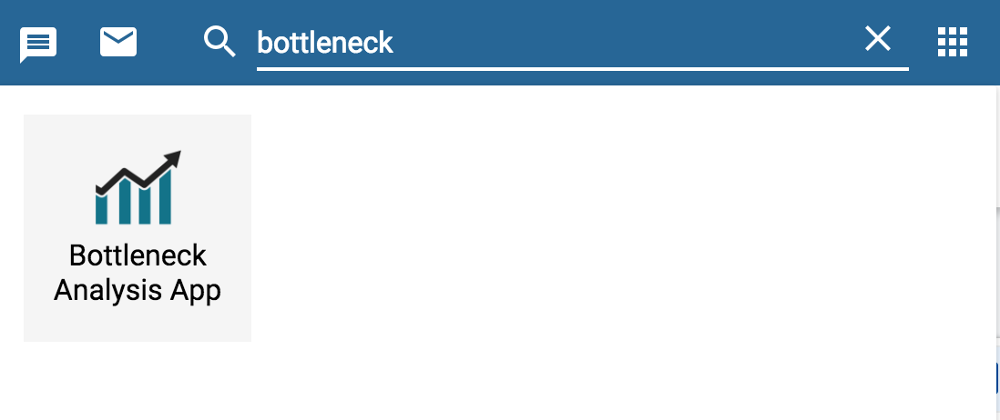

## Starting an Intervention

Once open, the bottleneck analysis application will bring a list of
created interventions, or when no intervention exists, a quick create
button will display for the user to create and add a new intervention.

The new intervention dashboard will display blank templates pending data
selection and filtering.                        

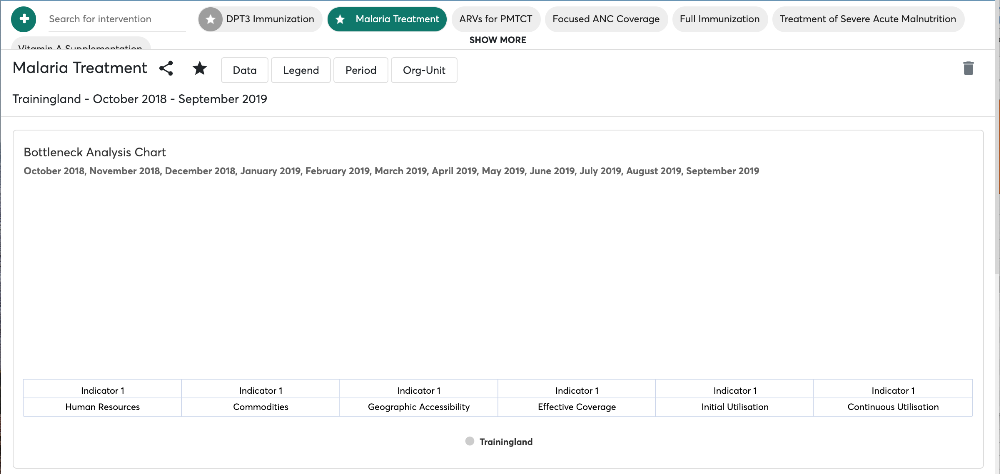

> **NOTE**
>
> If bottleneck analysis application is taking
too long to load, and you’re not slow on network, make sure you have
cleared your browser cache. See [BNA App Maintenance](#bna-app-maintenance) for
additional information on clearing browser cache.

The bottleneck app makes good use of cached files for better offline
experience, as a result, when installing higher versions, the bottleneck
app may use older version of cached files and thus break down while
loading.

## Using global filters

### Data selection

The administrator user can make data selections from the global filters
by simply selecting data. Currently the  BNA Application supports data
selections of Indicators and Functions. Clicking the Data filter control
opens a panel with a list of indicators complemented with a list of data
dimension groups. When a user selects an indicator or a function from
the list of available data items the selected data items will be
populated to the active data dimension group.

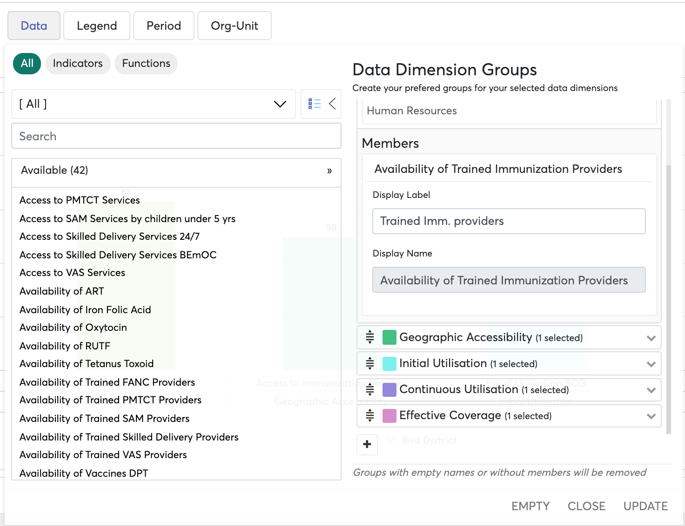{ width=80% } 

> **NOTE**
>
> Long indicators can be shortened by
entering alternative display name as indicated above. This will ensure
you chart readable and easily interpretable.

### Legend Configurations

The administrative user can set legend for each indicator in every
intervention to show low, medium and high bands with their cut-off
points. Administrator can set colors for each band for visualization.
Currently the BNA App uses three classes of colors to present indicator
performance as per defined cut-off points. Red shows low performance,
with yellow and green showing medium and good performance respectively.
To manage the Legend, administrator must click Legend tab in Global
filter, then select the specific indicator to be set the legends.

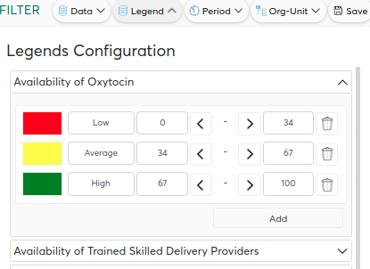

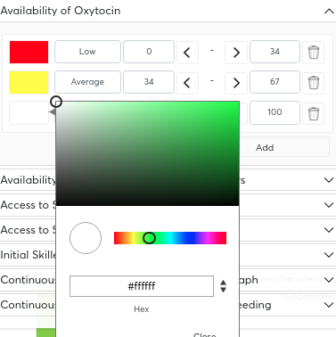

> **NOTE**
>
> Continuous legends must consist of legend
items that end and start with the same value, for example: 0-50 and
50-80. Do not set legend that leaves gaps or overlaps such as 0-50 and
51-80 or 0-50 and 45-80 etc.  

> **NOTE**
>
> For any changes made, administrative
user must click update button displayed in the working window and save
changes for persistence, or just close the message in case of rejecting
the changes.

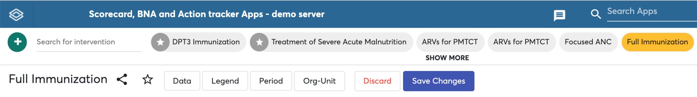

### Period selection

The BNA App allows you to make period selections for fixed periods,
relative periods and extended relative periods.

All period selections types begin with clicking the period button on the
global filters menu. Then clicking on the period type select option
button which lists all the period types.

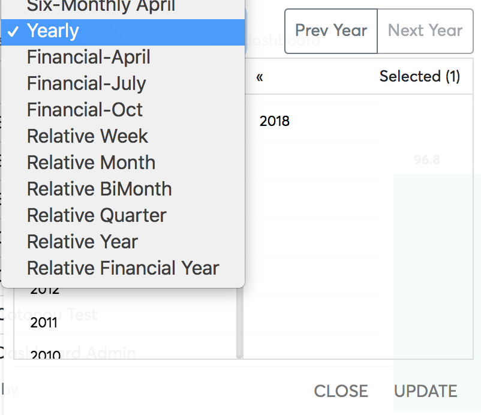{width=50%}

#### Fixed period selections

To select fixed periods, start by selecting a period type from the
period type list. You can then select periods from the list of available
periods.

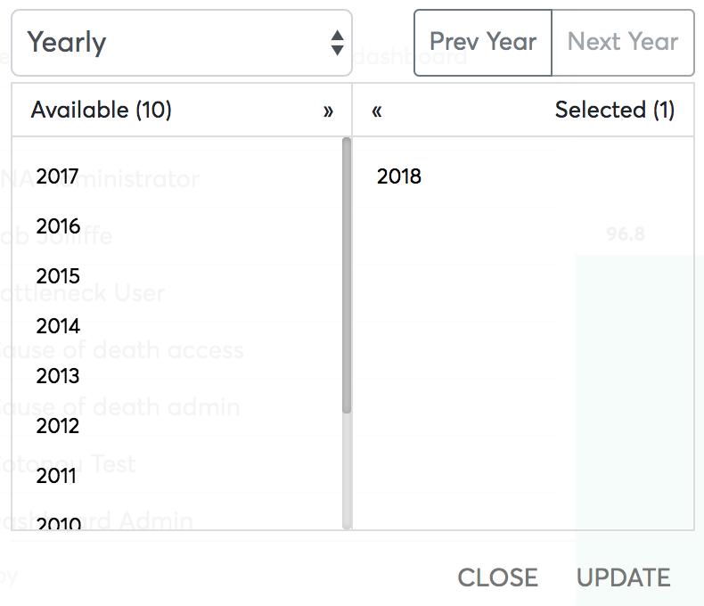{width=50%}

#### Relative period selections

To select relative periods start by selecting a period type from the
period type list. You can then select periods from the list of available
periods.

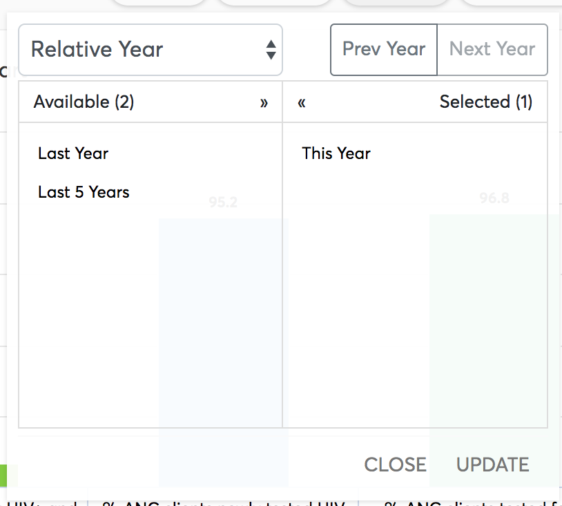{width=50%}

### Organization units selection

The BNA App allows the user to make organization unit selections based
on groups, levels and user organization units, these are known as
selection modes.

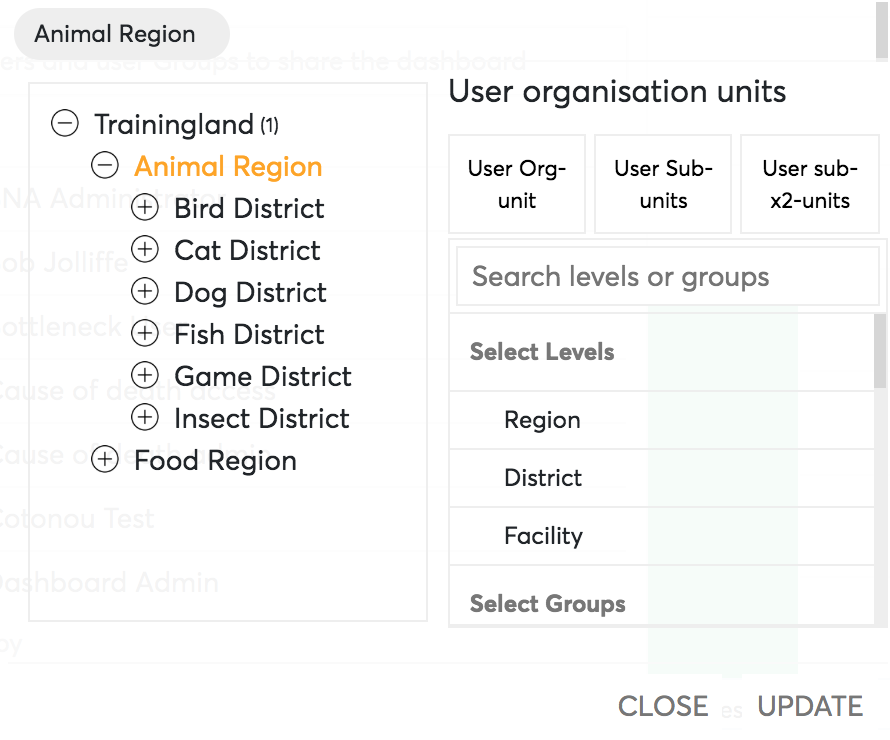{width=50%}

#### Selection by levels and groups

From the list of Levels on the under the input box that reads “Search
Levels or groups”, users can then make their selections by clicking the
desired levels to view on the analysis on the BNA App.

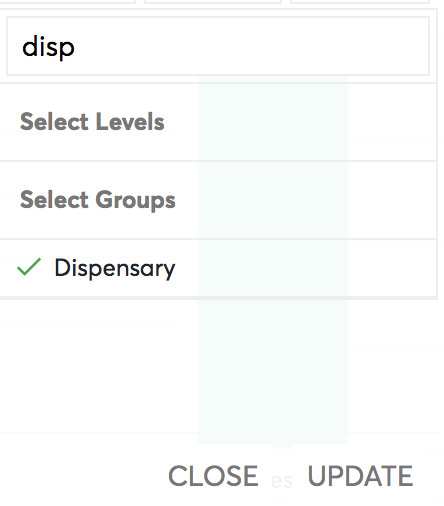{width=50%}

#### Selection by user organization unit

To the top of the selection by level there are buttons which are for
selecting organization unit relative to the user-assigned organization
unit.  This gives flexibility for the users to view the data based on
their assigned orgunits or suborgunits of their assigned orgunits.

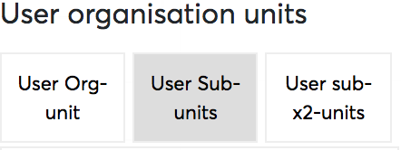{width=50%}

> **NOTE**
>
> Selections by user organization unit
disables selection by organization unit tree. To disable selection by
user organization unit simply click the active option (the one which
appears with gray background) to inactivate it and enable selection by
organization unit tree.

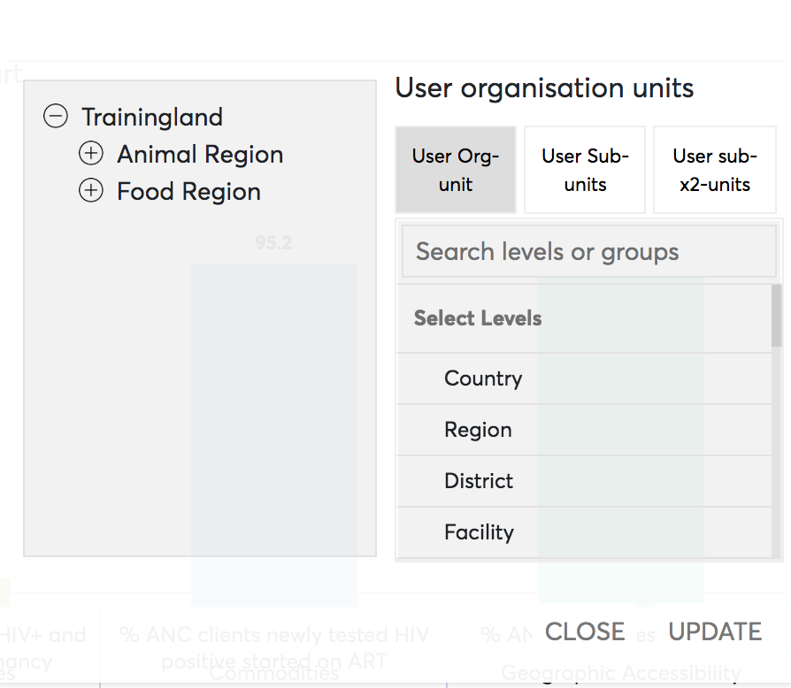{width=50%}

### Saving Configurations

After the administrator is satisfied with the filters that they have
applied for an intervention they have saved these configuration they
have made for the interventions. To save the configurations they simply
have to click the “Save” button.

> **NOTE**
>
> Editing and saving configurations of a
shared intervention will reflect the new configurations to the district
end user with whom the intervention has been shared with.
