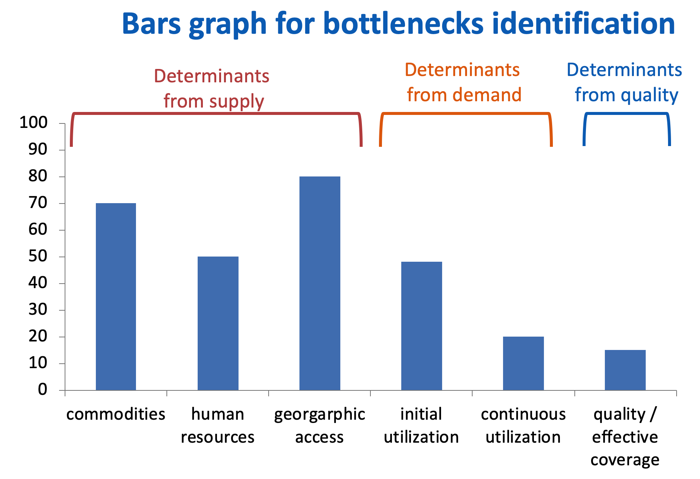

# Setting-up a New BNA App

The BNA App utilizes available metadata and data in the DHIS2 instance.
It is important to ensure that these are properly configured prior to
installing the app. The development team has put together pre-configured
metadata for sample indicators found here. You can download these and
use them as an example to setup a local BNA app use case

## Getting started

The following section describes a list of tips for getting off to a good
start when developing a new database.

5.  Identify a real life use case use in the BNA process.
6.  Discuss and identify priority indicators to use in the BNA process.
7.  Quickly populate a demo instance, include examples of BNA charts,
    tables and dashboard. Use real data, ideally nationwide, but not
    necessarily facility-level data.
8.  Put the demo database online. Server hosting with an external
    provider server can be a solution to speed up the process, even if
    temporary. This makes a great collaborative platform and
    dissemination tool to get buy-in from stakeholders.
9.  The next phase is a more elaborate BNA implementation process. Parts
    of the demo can be reused if viable.
10. Make sure to have a local team with different skills and background:
    public health, data administrator, IT and project management.
11. Use the customisation and database design phase as a learning and
    training process to build local capacity through learning-by-doing.
12. The core national team should drive the implementation process but
    be supported and guided by experienced stakeholders.

## Controlled or open environment

For purposes of compliance, it is important that development process be
done in a controlled environment to minimize interruptions from
untrained users. A collaborative approach needs to be undertaken during
the initial stages of metadata and indicator generation to gain by-in
and input from all stakeholders.

## Users and System Specifications

### Data elements and datasets

Data elements are the most critical and important part of a new
instance. For BNA, these will most likely existing in the national
instance. Where a review and update is required, ensure that national
and sub-national stakeholders, participate in the review.

For the BNA App, No data entry is required and therefore no datasets,
however, during data import it will be necessary to double check whether
data imported from other systems has been committed.

For data elements that cannot be easily tracked within an existing
national instance, consideration to create them should be given due
attention.  

### Indicator definition and mapping

Indicator definition and mapping are critical to the BNA process.
Depending on the program interventions a country is implementing,
priority indicators should be selected, for example immunization
(Availability of commodities {BCG, TT}, Immunization coverage etc.)

The indicator selection process should be a collaborative approach
including stakeholders for the selected program intervention(s).

A complete Indicator definition document should be drafted to detail;
numerators, denominators, methods of collection and calculation to
provide adequate information to the development team.

### Data collection and storage

BNA Indicators rely mostly on data collected from health programs in an
existing national system. The data may be routine or survey-based
following national guidelines. This process is applicable to a typical
situation where BNA is integrated in the national DHIS2 system.

Data entered on the  BNA app is by default stored in the DHIS2 “Data
store”. The data store is resident on the server hosting the DHIS2
instance and can be modified using the DHIS2 data store management app.

> **NOTE**
>
> When the BNA App is uninstalled from the
DHIS2, the data store remains, unless if the data store is removed.

Access to the BNA datastore is limited to system administrators only

Indicators whose data cannot be generated from the existing national
DHIS2 system such as project populations, ratios, target and coverage
estimation should be created and data imported into the host system.

### Data analysis and presentation

Data analysis and presentation on the BNA app is based on the Tanahashi
Model for health systems strengthening and strategic planning. The model
emphasises 6 determinants of coverage (Availability of Commodities,
Availability of Human Resources, Access to health facilities, Initial
utilization of health services, Continuous utilization and Effective
Coverage.)

Data visualization is interactive with dynamic relative periods and
organisation units. BNA charts will also be automatically generated once
DHIS2 data has been updated.

{.center}

> **NOTE**
>
> The golden rule for analyzing BNA charts is
 “The demand side cannot be higher than the lowest bar in the supply
side” where the denominator is the same.

Data on the BNA chart is further displayed in a sub-national level
tables to show performance of facilities using a scorecard colors (Red,
Amber & Green).

Data entered in the BNA app using the root cause analysis feature can be
analyzed based on the organisation unit, and period of analysis.

> **NOTE**
>
> all the data presentation charts, tables and
reports can be downloaded to either Excel, PDF or Word.

### Identifying users (National Vs District)

Users of the BNA should be cross-cutting from program managers at the
national level to district and facility users at lower levels of
implementation.

To organize BNA implementation, it is important to group the users for
easy management and assigning system privileges. Some examples of user
groups include National users, District Users, Facility Users.

