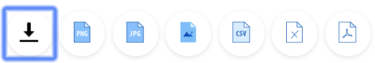
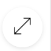

# Visualization operations        

## Downloading of visualization

To download the Visualization, hover over the chart, in the
b\]Bottom-left-corner, look out for the download icon below;

 Click on this Icon to download the chart using
the various formats available.

The Formats provided include, PNG, JPG, CSV, Excel & PDF.

## Basic/Full screen visualization

The BNA App support Basic and full screen views for all visualizations.
To view the chart in full screen, point your cursor in the
top-right-corner of the visualization and click on this icon: 
The visualization should display in full screen.
